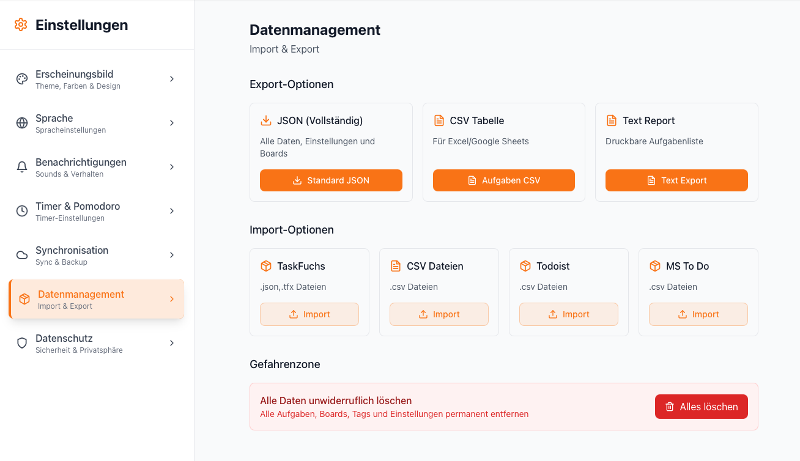

# TaskFuchs – ein Werkzeug, das mir beim Arbeiten hilft

Ich habe TaskFuchs gebaut, weil ich ein ruhiges, zuverlässiges Werkzeug wollte, das mich im Alltag nicht ablenkt. Kein großes System, keine neue Methode – nur eine Oberfläche, in der ich Aufgaben sammle, plane, abarbeite und mit der ich mich wohlfühle. Vieles ist bewusst schlicht geblieben. Das meiste ist in kleinen Schleifen entstanden: ausprobieren, anpassen, wieder nutzen.

Ich nutze TaskFuchs täglich. An manchen Tagen plane ich sehr konkret, an anderen kuratiere ich nur ein kleines Fokus‑Board. Beides soll ohne Reibung funktionieren.

---

## Wie TaskFuchs entstanden ist
- Ich habe die App allein entwickelt und mir dabei regelmäßig Hilfe von KI geholt. Das war kein Autopilot – eher ein technisches Sparring: Varianten abwägen, Stolpersteine finden, Details klarziehen.
- Ich habe bewusst auf Gewichte verzichtet: kein aufwändiges Setup, keine fremden Konten nötig. PWA statt nativer Installation, Export/Import ohne Hürden.
- Viele Entscheidungen sind pragmatisch: lieber stabil und klar als überladen.

---

## Wie ich TaskFuchs im Alltag nutze
Es gibt zwei typische Modi, zwischen denen ich je nach Tag wechsle.

### 1) Planer – wenn ich den Tag frei gestalten kann
Ich ziehe mir die wichtigsten Aufgaben in mein Tagesboard, grob in Reihenfolge. Timer helfen mir, dranzubleiben, oft im Pomodoro‑Rhythmus.

Was mir daran hilft:
- **Übersicht**: Der Tag fühlt sich wie eine Strecke an, nicht wie ein Durcheinander.
- **Einschätzung**: Mit Zeiten im Blick überlaste ich mich seltener.
- **Fluss**: Timer geben einen Takt, ohne Druck aufzubauen.

Kleine Routine:
- morgens 5–10 Minuten kuratieren
- nach jeder Einheit kurz prüfen: passt die Reihenfolge, passt die Zeit?

### 2) Pins + Ivy‑Lee – wenn Termine den Tag zerstückeln
An dichten Tagen kuratiere ich mir ein kleines Board mit maximal sechs Aufgaben (Ivy‑Lee‑Methode). Reihenfolge klar, dann eins nach dem anderen. Kein Herumspringen.

Warum das funktioniert:
- **Weniger Reibung**: Einmal entscheiden, dann abarbeiten.
- **Fokus**: Kein Zeitdruck – nur eine kurze Liste mit klarer Reihenfolge.

---

## Inbox – Gedanken ablegen, Kopf frei halten
Ich notiere alles sofort in die Inbox – auch Unfertiges. Einmal am Tag sortiere ich:
- planbar → in den Planer
- wichtig ohne Datum → anpinnen
- unklar → konkretisieren, delegieren oder löschen

---

## Review – regelmäßig aufräumen statt ansammeln
Im Review‑Bereich arbeite ich Aufgaben ohne Datum/Projekt durch. Ich entscheide: planen, pinnen oder später prüfen. Ziel ist nicht, alles perfekt zu ordnen, sondern nichts vergammeln zu lassen.

---

## Task‑Modal – direkt, ohne Umwege
- In die Beschreibung kann ich direkt klicken und tippen (kein Extra‑Button).
- Erinnerung: Nur sichtbar, wenn eine Zeit gesetzt ist – sonst ein schlichtes „+“.
- Navigation: Pfeile links/rechts neben dem Modal (auch mit ←/→). Beim Speichern springe ich in der Inbox automatisch zur nächsten Aufgabe.

---

## Timer – Struktur, nicht Stress
- Standard‑Timer für freie Arbeit, Pomodoro für Rhythmus.
- Anzeige mit Sekunden (mm:ss bzw. hh:mm:ss), ohne visuelle Spielereien.
- Akustischer Hinweis am Ende, Kaffeetasse nur in Pausen.

---

## Sync & Backup – ohne Abhängigkeiten
- Optionales Backup per Dropbox (auf dem eigenen Speicher).
- Export/Import als JSON, inklusive Boards, Pins, Projekten, Spaltennamen, Einstellungen.
- Die PWA informiert, wenn eine neue Version bereitsteht.

---

## Tastenkürzel (Auswahl)
- Navigation: `1` Heute, `2` Inbox, `3` Planer, `4` Projekte, `5` Notizen
- Review: `A/←` vorherige, `D/→` nächste, `C` planen, `R` später, `X` archivieren, `E` bearbeiten
- Timer: `Space` pausieren/fortsetzen (wenn sichtbar), `F` Fokusmodus
- Quick Add: `Q` neue Aufgabe

---

## Technisches kurz angerissen
- React und TypeScript, Zustände über Context. PWA aus Überzeugung: leicht zu verteilen, schnell zu aktualisieren.
- Viel Wert auf Konsistenz: gleiche Abstände zwischen Boards, gleiche Hintergründe (hell/dunkel), klare Icons.
- KI habe ich vor allem für Denkarbeit genutzt: Schnittstellen sauber halten, Kantenfälle finden, Formulierungen schärfen.

---

## Grenzen und To‑dos
- Mobile fühlt sich gut an, ist aber kein eigener nativer Client.
- Barrierefreiheit ist besser geworden, bleibt aber ein Feld, in dem ich weiter nachbessere.
- Feedback hilft. Wenn dir beim Nutzen etwas reibt, sag mir bitte Bescheid.

---

## Schluss
TaskFuchs soll nicht imponieren, sondern helfen. Wenn es dir ähnlich geht wie mir – du willst deine Aufgaben ruhig organisieren, ohne viel Drumherum – könnte es dir liegen. Ich freue mich über Hinweise, Kritik und Vorschläge. Danke fürs Lesen.
