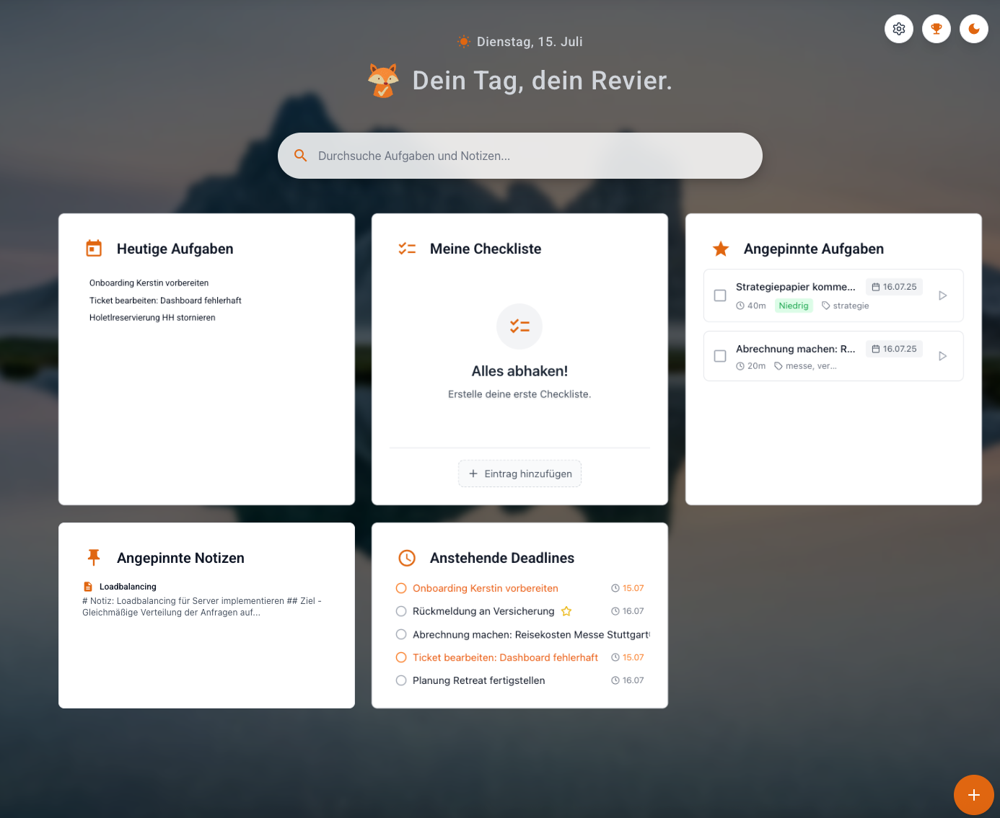
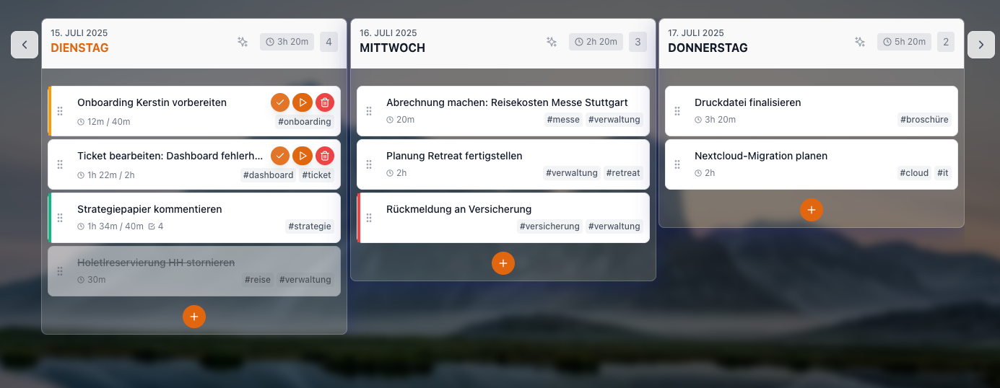
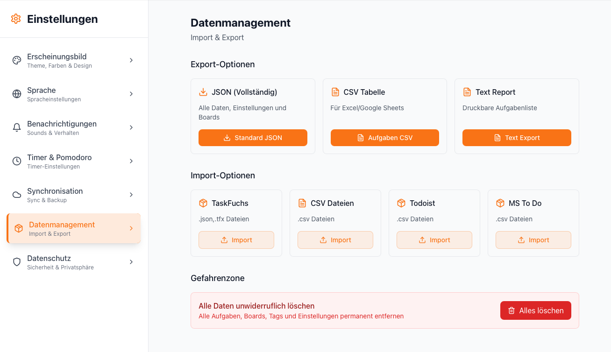

# TaskFuchs

Moderne Aufgaben- und Zeitverwaltung als Web‑App und Desktop‑App (Electron). Minimalistische UI, Dark Mode, i18n und optionale Sync‑Anbindungen.

## Features (Phase 1 & 2 - Aktuell implementiert)

### ✅ Grundfunktionalität
- **Spalten-Layout**: Tagesbasierte Spalten und Projekt-Spalten
- **Drag & Drop**: Aufgaben zwischen Spalten verschieben
- **Responsive Design**: Funktioniert auf Desktop und Mobile
- **Dark/Light Mode**: Automatische Theme-Erkennung
- **Internationalisierung**: Deutsch und Englisch
- **Moderne UI**: Minimalistisches Design mit Tailwind CSS

### ✅ Aufgabenverwaltung
- **Task Cards**: Übersichtliche Darstellung mit Prioritäten
- **Unteraufgaben**: Support für Subtasks mit Progress-Anzeige
- **Markdown**: Rich Text Beschreibungen mit Markdown-Support
- **Zeitschätzungen**: Geplante und aufgewendete Zeit
- **Tags**: Kategorisierung und Filterung
- **Suche**: Volltext-Suche durch alle Aufgaben

### ✅ Timer & Zeitmanagement
- **Timer Integration**: Play/Pause Buttons in Task Cards
- **Zeiterfassung**: Getrackte vs. geschätzte Zeit
- **Pomodoro Ready**: Vorbereitung für Pomodoro-Technik

## Tech Stack

- **Frontend**: React 18 + TypeScript
- **Build Tool**: Vite
- **Styling**: Tailwind CSS
- **Icons**: Lucide React
- **Drag & Drop**: @dnd-kit
- **Internationalization**: react-i18next
- **Date Handling**: date-fns
- **Markdown**: react-markdown

## Installation & Entwicklung (Web)

```bash
# Dependencies installieren
npm install

# Development Server starten
npm run dev

# Build für Production
npm run build:web

# Preview der Production Build
npm run preview

## Desktop (Electron)

Build lokal (macOS als Beispiel):

```bash
npm run dist:mac-dmg
```

Siehe `DESKTOP-APP-README.md` für Details (Signierung, White‑Window‑Fix, `vite.config.ts` base‑Pfad, etc.).
```

## Projektstruktur

```
src/
├── components/          # React Komponenten
│   ├── Layout/         # Sidebar, Header
│   └── Tasks/          # TaskBoard, TaskColumn, TaskCard
├── context/            # React Context für State Management
├── i18n/              # Internationalisierung
│   └── locales/       # Deutsch/Englisch Übersetzungen
├── types/             # TypeScript Interfaces
└── utils/             # Utilities und Services

Weitere Ordner:
- `public/` statische Assets (Icons, Manifest, Electron-Entry)
- `dist/` Build-Ausgabe (gitignored)
- `dist-electron/` Electron-Builds (gitignored)
- `docs/` begleitende Dokumente
```

## Screenshots

Einige Eindrücke (siehe `public/screenshots/`):






## Geplante Features

Die Entwicklung erfolgt in Phasen gemäß [TaskFuchs-Plan.md](../TaskFuchs-Plan.md):

- **Phase 3**: Timer-Funktionalität, Pomodoro-Integration
- **Phase 4**: UI-Verbesserungen, Sound-Warnungen
- **Phase 5**: Wiederholungen, Kalenderansicht
- **Phase 6**: Tags & Suche (erweitert)
- **Phase 7**: Kanban-Board
- **Phase 8**: Benutzerkonten & Synchronisation

## Design-System

- **Primary Color**: Anpassbare Akzentfarbe (Standard: #0ea5e9)
- **Fox Branding**: Orange (#f97316) für das Logo, Grün (#22c55e) für Erfolg
- **Typography**: Inter Font Family
- **Responsive**: Mobile-First Design

## Beiträge & Lizenz

Pull Requests willkommen. Bitte vorab Issues anlegen, wenn größere Änderungen geplant sind. Lizenz siehe `LICENSE`.

---

**TaskFuchs** 🦊 - Deine smarte Aufgabenverwaltung
