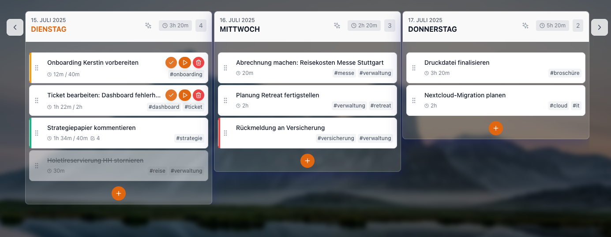
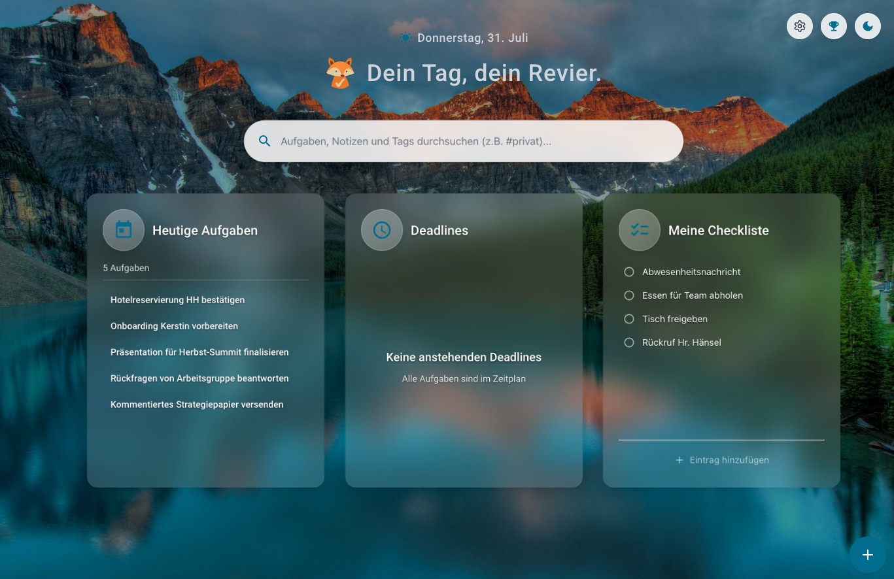
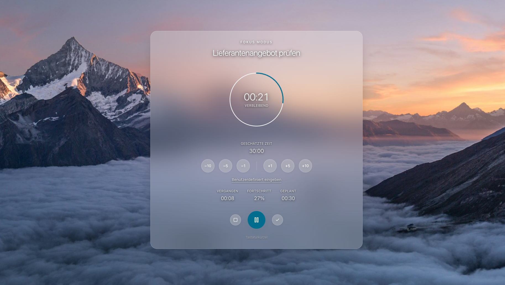

# TaskFuchs

Modern task and time management – available as a Web App and Desktop App (Electron). Minimal UI, Dark Mode, i18n, and optional sync integrations.



**Web page: [www.taskfuchs.de](https://www.taskfuchs.de)

## Features (Phase 1 & 2 – currently implemented)

### ✅ Core functionality
- **Column layout**: Day‑based columns and project columns
- **Drag & drop**: Move tasks between columns
- **Responsive design**: Works on desktop and mobile
- **Dark/Light mode**: Automatic theme detection
- **Internationalization**: German and English
- **Modern UI**: Minimal design powered by Tailwind CSS

### ✅ Task management
- **Task cards**: Clear presentation with priorities
- **Subtasks**: Support with progress indicator
- **Markdown**: Rich text descriptions with Markdown support
- **Time estimates**: Planned vs. spent time
- **Tags**: Categorization and filtering
- **Search**: Full‑text search across tasks

### ✅ Timer & time management
- **Timer integration**: Play/Pause from task cards
- **Time tracking**: Tracked vs. estimated time
- **Pomodoro ready**: Prepared for Pomodoro technique

## Tech Stack

- **Frontend**: React 18 + TypeScript
- **Build tool**: Vite
- **Styling**: Tailwind CSS
- **Icons**: Lucide React
- **Drag & drop**: @dnd-kit
- **Internationalization**: react‑i18next
- **Date handling**: date‑fns
- **Markdown**: react‑markdown

## Installation & development (Web)

```bash
# Install dependencies
npm install

# Start development server
npm run dev

# Build for production
npm run build:web

# Preview the production build
npm run preview
```

## Desktop (Electron)

Build locally (macOS example):

```bash
npm run dist:mac-dmg
```

See `DESKTOP-APP-README.md` for details (code signing, white‑window fix, `vite.config.ts` base path, etc.).

## Screenshots






## Design system

- **Primary color**: App accent color (configurable in settings)
- **Fox branding**: Orange (#f97316) for the logo, Green (#22c55e) for success
- **Typography**: Inter font family
- **Responsive**: Mobile‑first design

## Contributing & license

Pull requests are welcome. Please open an issue first for major changes. See `LICENSE` for licensing details.

## Security & secrets
- Never commit real credentials; use `.env.local` for local dev and GitHub Secrets in CI.
- Only variables prefixed with `VITE_` are exposed to the client – treat them as public.
- Example file: `.env.example` (copy to `.env.local` and fill in values).

## Web App

- Live: [`https://app.taskfuchs.de`](https://app.taskfuchs.de)
- Install as PWA:
  - Desktop (Chrome/Edge): Address bar “Install app” button or menu → “Install app”.
  - iOS (Safari): Share → “Add to Home Screen”. Afterwards it launches like a native app.
  - Android (Chrome): Three‑dot menu → “Install app” / “Add to Home screen”.
  - Updates: The app auto‑updates. When a new version is available an in‑app banner appears – click to reload instantly.

---

**TaskFuchs** 🦊 – Your smart task manager

